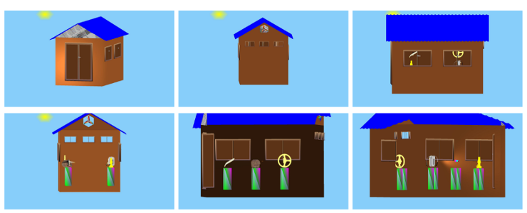

### Introduction
This is the main repository for the project PH7. PH7 is a virtual
museum based on OpenGL and GLut. This project was a course term project
which we later converted it to open source.

The virtual museum is a room in which different objects are placed in
presence of various light sources. The user can see objects from
different directions. Other features include:
1. Zoom in/out
2. rotation of objects on different axis
3. movement : forward, backward, left and right
4. look : up, down, left, and right

PH7 models the room with windows, a door, walls, a roof and a
ventilating fan. Inside the room are antiquities placed on stands.
The models of these antiquities are taken from
[Burkardt](http://people.sc.fsu.edu/~jburkardt/).
[These models are](http://people.sc.fsu.edu/~jburkardt/data/ply/ply.html):
 * Aeroplane
 * [Human skull](http://people.sc.fsu.edu/~jburkardt/data/ply/skull.png)
 * Lamp
 * Torch
 * [Walkman](http://people.sc.fsu.edu/~jburkardt/data/ply/walkman.png)
 * Wheel



For further information please refer to the project
[ report](docs/PH7_project_report.pdf) and
[presentation](docs/PH7_presentation.pdf).

### Prerequisites
* This project has been successfully tested on **Ubuntu 16.04 LTS**.
* **OpenGL** and **GLut**: To successfully build and run this virtual
museum, you need to have OpenGL and GLut installed. You can search for
online tutorials on how to install them, but the following series of
commands can prove useful on Ubuntu.
```bash
sudo apt-get install mesa-utils
sudo apt-get install -y build-essential libgl1-mesa-dev
sudo apt-get install -y libglew-dev libsdl2-dev libsdl2-image-dev libglm-dev libfreetype6-dev
sudo apt-get install -y freeglut3-dev
```
* *GCC with C++11 support*.
* *GNU Make*

### How to build
There is a make file at the main directory of the project. To build the
project run the command
```bash
make
```
If successful, this command produces the executable named `ph7Museum`.

### How to run
Run the following to launch the museum
```bash
./ph7Museum
```

### How to interact with the museum
The following help message from the museum lists important keyboard
keys to interact with the museum once it launches.
```
================================================================
=                                                              =
= Welcome to PH7: The Virtual museum developed only on OpenGL. =
=                                                              =
================================================================
=                                                              =
=         HOW TO INTERACT WITH THE MUSEUM                      =
=                                                              =
================================================================
=   Keys         ==             Function                       =
================================================================
=  H or h        ==  To get this help message.                 =
=  Mouse-click   ==  To pick an(any) object.                   =
=  I or i        ==  To reset the museum                       =
=  Z             ==  To zoom IN                                =
=  z             ==  To zoom out                               =
=  f             ==  To move forward                           =
=  F             ==  To move backward                          =
=  S or s        ==  To change shading                         =
=  A or a        ==  To turn auto rotation on/off of antiques  =
=                                                              =
=  Left arrow    ==  To rotate Left                            =
=  Right arrow   ==  To rotate Right                           =
=  Up arrow      ==  To rotate up                              =
=  Down arrow    ==  To rotate down                            =
=  Click on door ==  To open / close the door                  =
=  Q or q        ==  To close/quit the museum                  =
=  Click window  ==  To open/close window (blend)              =
================================================================
```

### The file structure of the project
If you would like to contribute to or customize this project for your
personal use, the file structure is as below.

* PH7
  - **README.md**    This file you are currently reading.
  - **Makefile**     The Main make file of the project.
  - **LICENSE.md**   The MIT License file
  - **TODO.txt**     A list of possible features to enhance the museum.
  - **bin**          Folder which holds the binary built by the make file.
  - **docs**         The directory containing documentation files of the project.
  - **incs**         The directory for the include files.
    - **Init.h**     The header file for functions implemented in Init.cpp.
    - **Keyboard.h** The header file for mouse and Keyboard functions.
    - **Object.h**   Contains the base class for all museum objects.
    - **Museum.h**   The header file for functions necessary for rendering all the objects.
    - **room** folder contains implementations of different parts of the museum. E.g; roof, **room**, windows, door, etc.
    - **antiquity**   folder contains definitions of antiquity objects.
  - **shaders**       contains the shaders
    - **MuseumFshader.glsl** The fragments shader of the museum.
    - **MuseumVshader.glsl**   The vertex shader of the museum.
  - **src**            The directory for the source files.
    - **Init.cpp**     Source code for initializing the shader programs.
    - **ph7Main.cpp**  Source code containing the main function for OpenGL and Glut.
    - **Keyboard.cpp** Implements the mouse and Keyboard events callbacks.
  - **libs**           The directory for any libraries and third-part source files.

[comment]: <> (https://github.com/skuhl/opengl-examples/blob/master/models/FREE-MODELS.txt)

### The main contributors in this project are:
   1. Hassan Salehe Matar
   2. Pirah Noor Soomro


### License & copyright
- Original code is published under the MIT License, see **_LICENSE.md_**
- Third part files and libraries retain their licenses.
- **(c) 2016 - 2018: Hassan & Pirah.**
